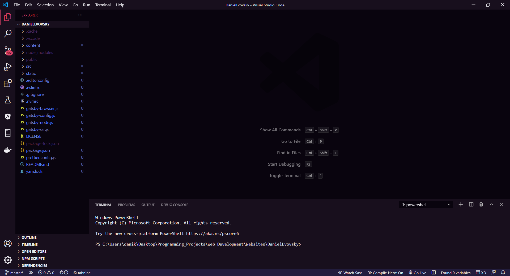
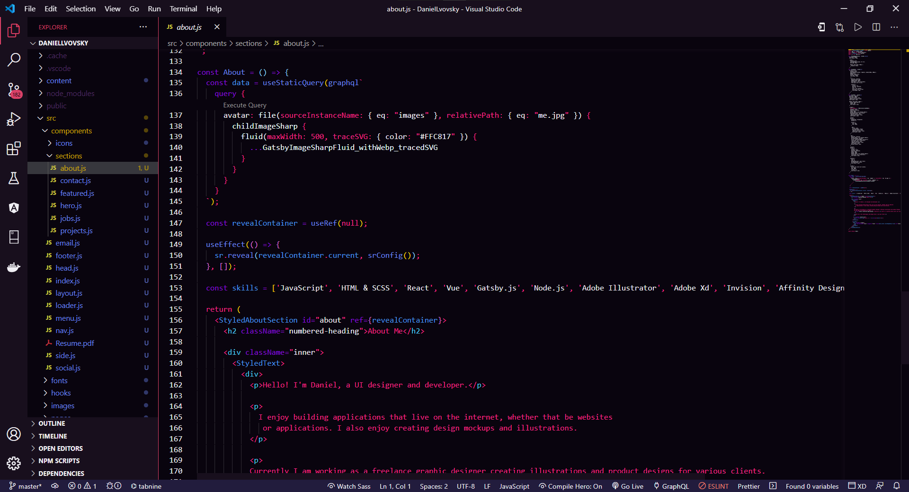
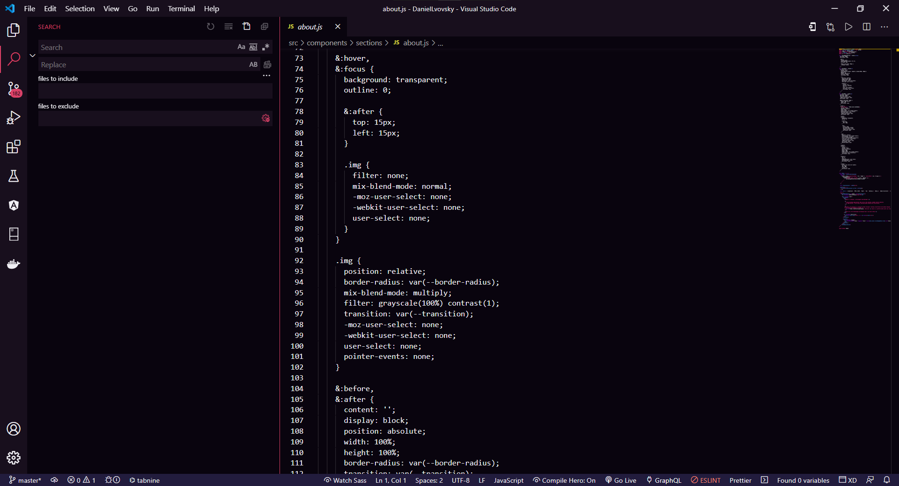
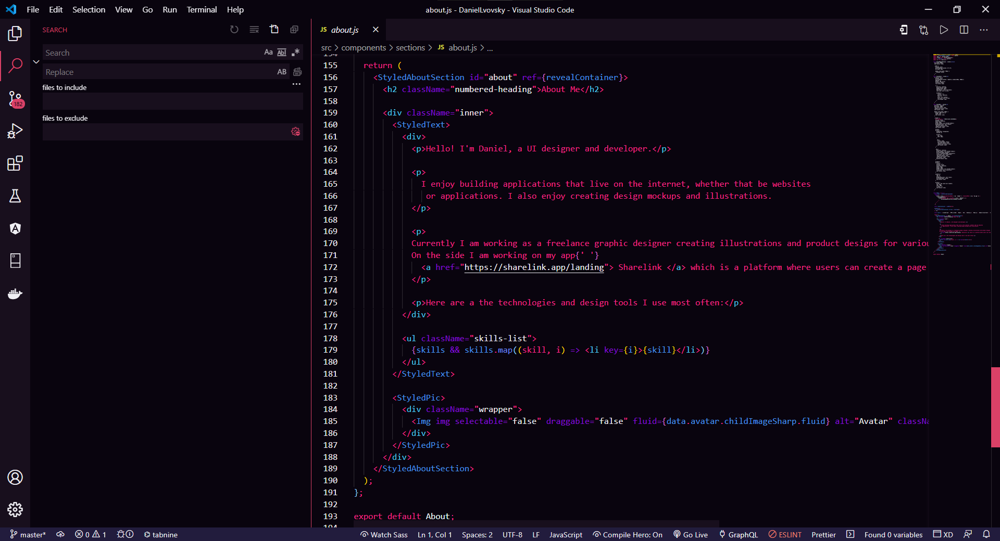
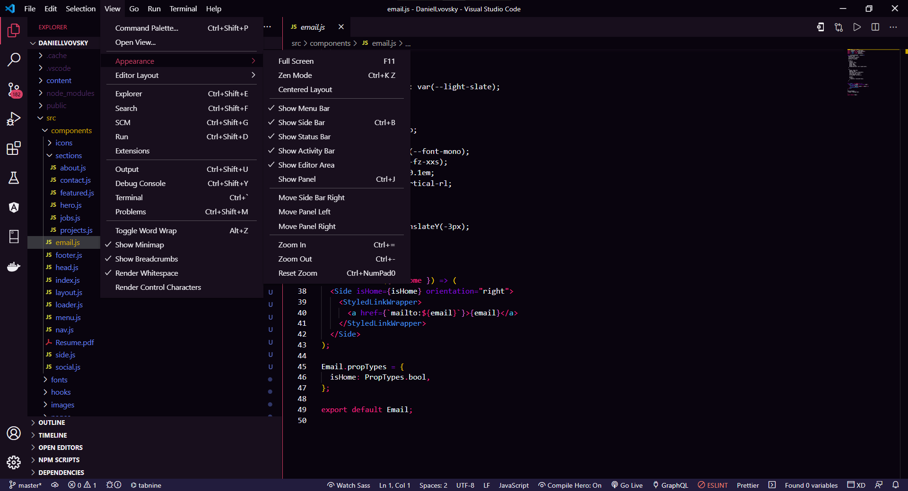

# Galax Theme For VS Code

## About Theme
Galax is a custom dark theme with a vaporwave color palette.

---

---

---

---

---

### Syntax Colors:
-  `#f0eff4`
-  `#6a83f1`
-  `#4cc9f0`
-  `#4895ef`
-  `#f72585`
-  `#850ad6`
-  `#d7335c`

### UI Colors:
-  `#09040e`
-  `#f0eff4`
-  `#da4167`
-  `#180f1d`
-  `#221c3d`

---

### Installation Instructions
* Open the extensions sidebar on Visual Studio Code.
* Search for the Galax Theme.
* Click "Install"
* Once Installed select the settings icon > Color Theme > Galax Theme.
* Feedback is always Appreciated

### Issues & Suggestions
* For any issues or suggestions, please go here [Github Repo](https://github.com/DanielLvovsky/GalaxTheme/issues)

**Enjoy and rate five-stars! ⭐⭐⭐⭐⭐**
